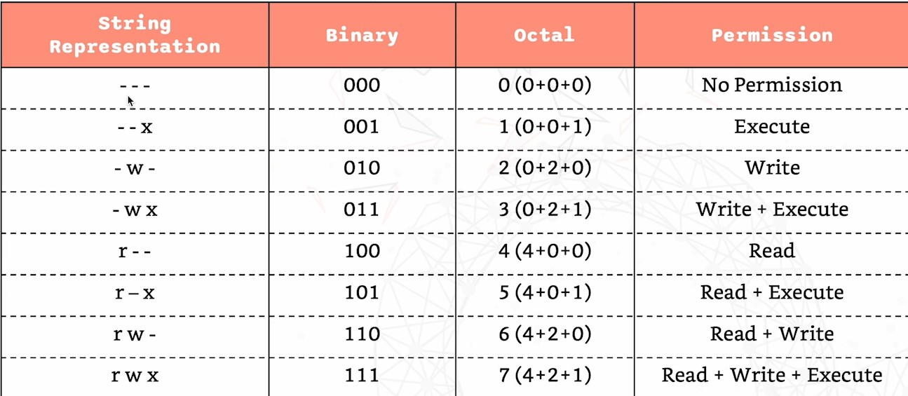
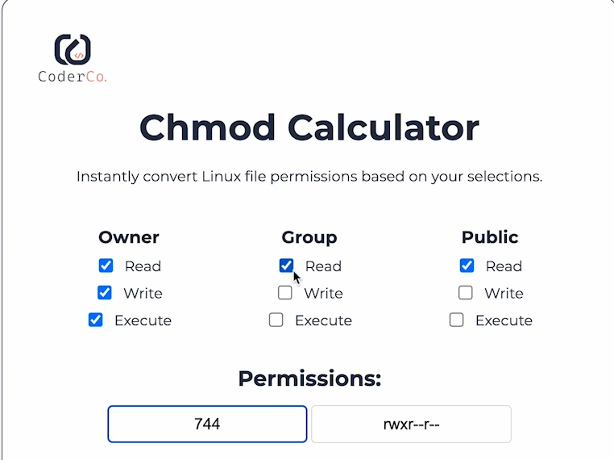
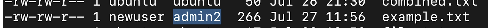

## FILE PERMISSIONS

### rwx

- r = read
- w = write
- x = execute


### File permissions can be represented in different ways:




- String representation 
  - Using rwx and -
  - `-` = no permission.

- Binary digits
  - Using 0s and 1s
  - E.g. 111 is read, write and execute permissions.
  - 1 = allowed.
  - 0 = not allowed.

- Octal 
  - Using compact numbers. 
  - Based on the base 2 numbers:
  - 1st number represents 2^0 = 1, 2nd number 2^1 = 2, 2rd number 2^2 =4.
  - E.g. 7 = all permissions.
  - 4 = read
  - 2 = write
  - 1 = execute

- Octal File permissions calculator
  


### CHMOD 
  - Symbolic = letters = rwx
  - `ls -l` = to see files with permissions

  - E.g `-rw-----w-` is 3 sections:
    - `rw-` = only read and write permissions = 6 (4+2)
    - `---` = no permissions = 0
    - `-w-` = only write permissions = 2
    - = 602

  - The 3 sections represent Owner, Group and Public permissions on a file. 

- `chmod u+x,g+r,o-w example.txt` :
  - `u+x` = giving user execute permissions
  - `g+r` = giving group read permissions
  - `o-w` = taking away others write permissions.
  - Setting these permissions to that specific file. 

- Can also set permissions using octal rep:
  - `chmod 750 example.txt`
  - 7 = full permissions for owner
  - 5 = read (4) and execute (1) permissions for group.
  - 0 = no permissions for others. 

### SIMPLE SCRIPT FOR PERMISSIONS

- `vim set_permissions.sh` = creates file and goes into it (editor).
- Scripts = executable files that can be ran as a program. 
- The file contents:

```
#!/bin/bash
# Change the permissions of example.txt to be executable by the user
chmod u+x example.txt
echo "Permissions changed for example.txt"

```
- This file gives the user executable permissions on example.txt and then prints in the terminal that the permissions are changed. 

- The file can't be run if it doesn't have executable permissions. 
- Add execute permissions = `chmod +x set_permissions.sh`
  - This gives execute permissions to user, group and others by default. 
- To run the script = `./set_permissions`
- The script has only `u+x` = only user gets executable permissions.
- Can also remove permissions by using `u-x` in the script. 

### Giving multiple permissions 

- Use the `=` operator.
- E.g. `chmod ug=rw,o=r example.txt` = user and group gets read and write permissions and others get read permissions. 

### Changing File/Dir Ownership for User/Group!

- Changing owner of a file/directory = `sudo chown newuser example.txt` 
  - This changes the owner of example.txt to newuser.

- Changing group that owns file/directory = `sudo chgrp admin2 example.txt` 



- This means that the file permissions 3 sections:
  - First section is to the newuser
  - 2nd section is to the admin2 group. 
  - This means that my user will no longer have permissions to edit that file unless using sudo. 
  - Have to switch to newuser to have access to that file now. 

- Changing both owner and group using chown
  - `sudo chown ubuntu:admin2 example.txt` 
  - Changes the user and group within one command. 

- Changing ownership of directory: user and group
  - `sudo chown -R newuser:admin2 my_directory`
  - All files within that directory will also have that new ownership.


