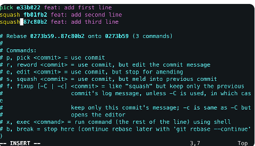
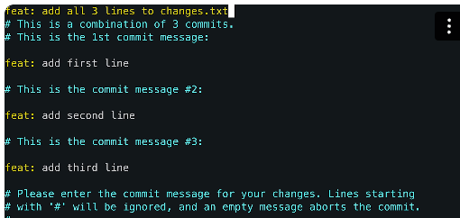
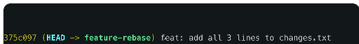

# Branching and Merging


## Branching 101

- Let you work on multiple things at once without messing up the main branch. 

- `git branch` = lists/creates branches.
  - Shows existing branches.
- `git checkout -b <branch>` = create and switch branch - older style.
- `git switch -c <branch>` = modern version to switch branch and create new branch (-c).
- `git switch <branch>` = switches branches safely (existing branch).
- `git branch -d <branch>` = deletes branch.

## Merging 

- Combine changes from one branch into another.
- `git merge <branch>` - merges target into the current branch.

### Fast forward merge 
- Simplest merge
- Happens when there's nothing to combine.
- E.g. No changes in main but changes in feature branch - simple merge to just update main to that same point as feature branch.
- Moves the pointer forwards.

```
Before:
main
  ↓
  A — B — C — D
              ↑
           feature

After fast-forward:
              main
               ↓
  A — B — C — D
              ↑
           feature

```

### Recursive merge 

- Used when git can't just fast foward merge.
- Both branches have new saves and the changes need to be properly combined.


- The merge:

From this: 
```
            E — F   ← feature
           /
  A — B — C
           \
            G — H   ← main

``` 

To this: Merge commit
```
            E — F
           /     \
  A — B — C       M   ← main
           \     /
            G — H

```

- To combine them, Git does a three-way comparison. It looks at three things:

    - The common starting point (save C, where the branches split)
    - What your branch changed since then
    - What the other branch changed since then

- If one side changed a file and the other didn't, Git keeps the change. 
  
- If both sides changed different parts of the same file, Git keeps both changes. 

- If both sides changed the same line in different ways, Git stops and asks you to choose. That's called a merge conflict. Manual resolution is required.

- When it's done, Git creates a new merge commit that ties both branches together.

## VISUALISE BRANCHES AND LOGS

- These are good for debugging!
- `git log --oneline` = compact commit view
- `git log --graph` = visual tree structure
- `git log --online --graph` = shows everything, compact, full view.


## REBASE VS MERGE

- merge is the reliable default, and rebase is a tidying tool.
  
### Merge
- Preserves history
- Creates a new commit
- Good for team flows
- Use when working collaboratively!!

## Rebase
- Rewrites history - linear 
- No merge commits
- Ideal for cleanup before PR
- Use when cleaning up your local history.

```
            E — F
           /     \
  A — B — C       M   ← main
           \     /
            G — H
```
Rebase takes your saves (E and F) and replays them on top of the latest main, as if you'd started your work from H all along. The result is one straight line, with no fork and no merge commit.

`A — B — C — G — H — E' — F'  ← feature`

- DO NOT REBASE SHARED BRANCHES!


## REBASE

- Clean up commits.
- Squash commits into one. 

-  `git checkout -b feature-rebase` --> switches to a new branch.
-  `echo "line 1" > changes.txt`
-  `git add changes.txt`
-  `git commit -m "add first line"`

Another commit:

- `echo "line 2" >> changes.txt`
- `git status`
- `git add changes.txt`
- `cat changes.txt` --> see that both lines are there.
- `git commit -m "add second line"`


Another commit:

- `echo "line 3" >> changes.txt`
- `git status`
- `git add changes.txt`
- `cat changes.txt` --> see that 3 lines are there.
- `git commit -m "add third line"`
 

- `git log --oneline` - to see all 3 commits. 


Final steps: squash all commits into one.

- Keep history clean: `git rebase -i HEAD~3` = Rebase last 3 commits.
- in the file opened -->  change the last 2 commits from `pick` to `squash` to make sure they all become one commit. 
- save and `:wq!`



- Then need to add a commit message for that squash at the top of the 2nd file opened:



- When doing `git log --oneline` - should see only one commit. 




PUSH THE 
- `git push --set-upstream origin feature-rebase` = pushing to the feature branch to see the commit changes. 