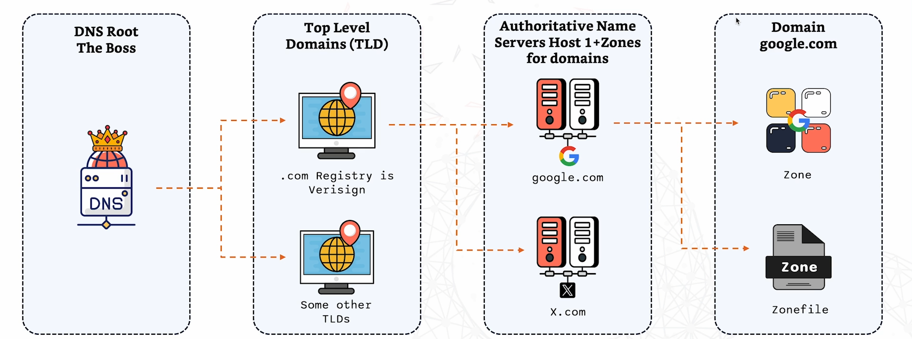
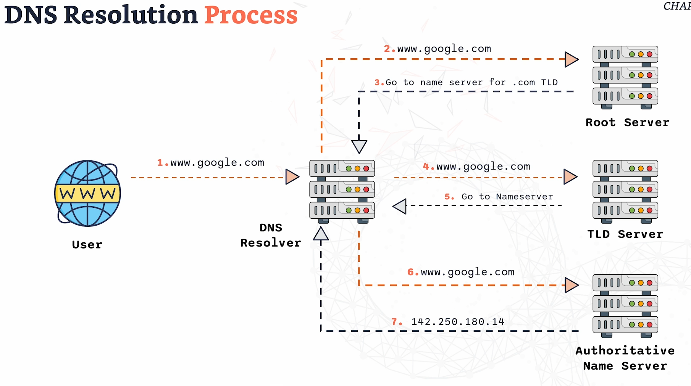
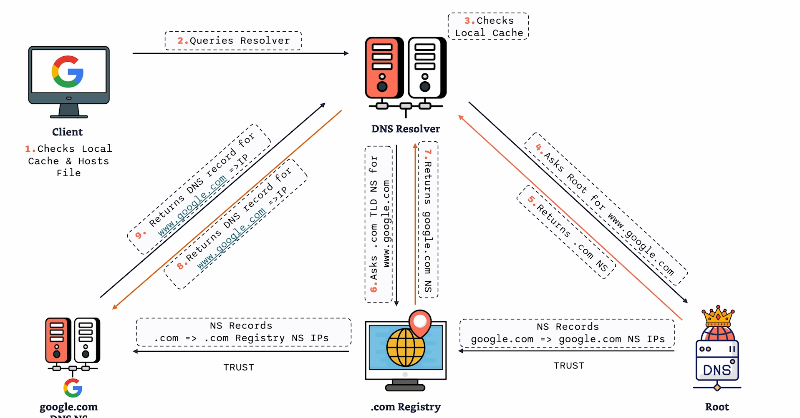

# DNS

- DNS = We can keep track of websites without knowing their IP address.
- Translates domain names into IP addresses in the back. 
- Simplifies navigation on the internet and it's essential for accessing websites and services.

## DNS Components

### Name Servers
- Load DNS settings and configurations.
- Authoritative = hold the actual DNS records. When required, they provide the definitive answer e.g. IP address for the domain name.
- Recursive = Do not hold the DNS records - hold other name servers they can query.

Finding name servers: 

- `dig ns google.com` = shows you the name servers. 
- `dig +short ns google.com` = shorter version showing you name servers.

### Zone Files
- Store information about the domain. 
- Organized and readable format of DNS information. 
- A zone is simply the set of records one authoritative server is in charge of, like one company’s own page in the phone book. Inside a zone are records, each with a job

### Records 
- A zone file = multiple resource records.
- Includes: 
  - Record name
  - TTL
  - Class
  - Type
  - Data
  - NS

DNS RECORDS:
  - A records --> maps a domain name to an IPV4 address.
  - AAAA records --> maps a domain to an IPV6 address.
  - CNAME --> alias for domain name e.g. www.google.com has alias - google.com.
  - MX --> specifies mail server for a domain, includes priority value. 
  - TXT --> Verification purposes.

## How does DNS work?

- Converts domain names to IP addresses.
- Involves multiple steps and servers.

### DNS Hierarchy and Distribution

1. DNS Root = the boss. 
   - Has the high level information on where to find the TLDs. 
   - E.g. it knows where to point you for the .com endings or .org etc.
   - Knows who is in charge of each top level domain.

2. Top level Domains (TLD)
   - Each TLD stores a list of every domain registered under it, and which name servers are in charge of each one.
   - A TLD is the last part of a web address, the bit after the final dot. 
   - There are two main kinds. Generic ones like .com, .org and .net, and country ones like .uk, .fr and .jp. 
   - There are also newer ones like .shop or .london.

3. Authoritative Name Servers Host 1 + zones for domains.
   - These are the servers that finally hold the actual answer, like “www.google.com is at this IP address".

4. Domain
   - A domain name is read right to left, from biggest to smallest, and each dot is a step down the tree. 
   - Take www.bbc.co.uk. Hidden on the far right is the root (an invisible dot). 
   - Then .uk is the country TLD, .co is a section under it for companies, bbc is the BBC’s own domain, and www is one specific computer or service within the BBC’s zone, called a subdomain. 
   - The BBC can create as many subdomains as it likes (news.bbc.co.uk, weather.bbc.co.uk) without asking anyone, because it owns that part of the tree.

The one-line summary

The root knows where the TLDs are, the TLDs know where each domain’s name servers are, and the authoritative name servers know the actual address. Nobody knows everything, but everyone knows who to ask next.

### The actual flow:

1. Say you type www.google.com. 
2. Your computer asks the resolver (like a librarian)
3. The resolver asks a root server, which says “try the .com servers.” 
4. It asks a .com server, which says “try Google’s name servers.” It asks Google’s authoritative server, which finally gives the IP address. 
5. The resolver passes that back to your computer, and your browser connects. This all usually takes a fraction of a second.

It’s even faster most of the time because of caching, which means remembering. Once the resolver has learned an answer, it keeps it for a set time (called the TTL, or “time to live”) so the next person who asks gets it instantly without walking the tree again. Your own computer and browser keep a little memory too.

## Domain Registrar vs DNS Hosting Provider

### Registrar
- = Purchase and register domains.
- The Registrar communicates with TLD registries to manage domain registrations

### DNS Hosting 
- Operates DNS Nameservers

- If the registrar and DNS hosting provider are the same company, the DNS zone is automatically created and hosted. 
- If they're different - need to provide the nameserver information where the DNS zone is hosted. 

## /ETC/HOSTS FILE

- A local file on your computer.
- Maps domain names to IP addresses. 
- Takes precendence over DNS for specific entries.
- Editing the host file:
    - Open file with a text editor `sudo vim /ect/hosts`
    - Add a line --> `IP ADDRESS <DOMAIN NAME>`
      - E.g `127.0.0.1 example.com`