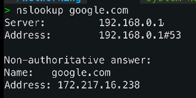
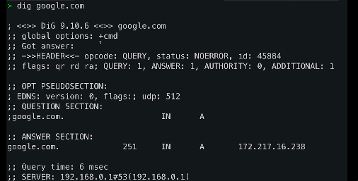

# Network Debugging and Troubleshooting Tools

## NSLOOKUP

- `nslookup <domain>`
- Basic DNS Query Tool
- E.g. `nslookup google.com`

- Server = internet provider.
- Address = same thing but specifies a port e.g. 53 = DNS.
- Authoritative or non authoritative answer:
  - Authoritative = Directly from authoritative server
  - Non Authoritative = came from cache and not directly from server.

### DIG

- `dig <domain>`
- Much more advanced than nslookup.
- Stands for - domain information groper.
- Querying dns servers.

- Question section --> shows query you made
- Answer section = list of IPs associated with domain.
- Query time etc. 

`dig +short google.com` = just gets info we need. e.g. IP. 
`dig +short ns google.com` = shows the nameservers. 

# TROUBLESHOOTING

- `ping` - Used to test any connectivity between devices.
- `traceroute <domain>` - tracks the path your data takes to reach a certain destination.
- `nslookup <domain>` - dns query tool.
