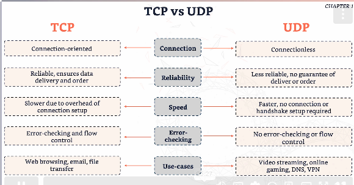

# Networking

## Computer Networks

- Connecting devices to share information.
- The purpose of them are to communicate and share resources.

### LAN 

- Local Area Network
- Small area e.g. home or office.
- Connects devices to share resource. 
- E.g. computers, printers etc. 

### WAN

- Wide Area Network
- Large area e.g. city, country or a larger region.
- E.g. Wifi
- Connects multiple LANs.

## Switches, Routers and Firewalls

### Switches 
- Connects multiple devices within the same network.
- Manages data flow within a LAN.
- Works with MAC addresses. Every device has a fixed MAC address.

### Routers
- Directs traffic between networks.
- Connect different networks e.g. home network to the wifi.
- Works with IP addresses.

### Firewalls
- Protect networks from unauthorized access.
- Monitor and control incoming traffic and outgoing network traffic. 

## IP Addresses

- Unique identifiers for devices on a network

### IPV4
- IPV4 --> 32 bit address.
- Format = `128.64.8.0`

### IPV6
- IPV6 --> 128 bit address.
- More IP addresses.
- Format = `128a.2001.8370.0db8.08db.08db.08db.08db`
- Written in hexadecimal - letters and numbers. 

### MAC addresses
- Unique identifier assigned to network interfaces.
- Operates at the data link layer - node to node transfer.
- Facilitates device identification within a local network.
- 48 bit address
- Format = `00.1A.2B.3C.4D.5E`
- Essential for network communication and security.
- E.g essential for making sure your laptop connects to the right router and not your neighbours. 

## Ports and Protocols

- Ports = logcal endpoints for communication.
- Protocols = rules governing data transmission.
- They facilitate communication between devices.

### TCP
- Trasmission Control Protocal
- Fundamental protocol.
- Ensures that data sent from one device reaches the other device accurately and in the correct order.
- Set of rules.

- Connection oriented --> connection is established before data is sent. 
- Requires handshake --> 2 devices agree to communicate. 3 step process.
- Reliable data transfer - TCP will resend any missing/corrupted data.

Functions/use-cases of TCP

- Ensures data is delivered in order.
- Error-checking and flow control.
- Any bidirectional communication (data back and forth).

### UDP
- User Datagram Protocol
- Straight forward - quick and easy to use.
- Simple protocol to send and recieve data.
- Prior communication not required (can be bad too - no gurantee that the data will reach destination).
- Connectionless = less error checking.
- Fast but less reliable.

Functions/use-cases of TCP
- Suitable for real-time applications e.g. video streaming.
- DNS - anything DNS related uses UDP behind the scenes.
- VPN - UDP works better for streaming.

### TCP VS UDP

