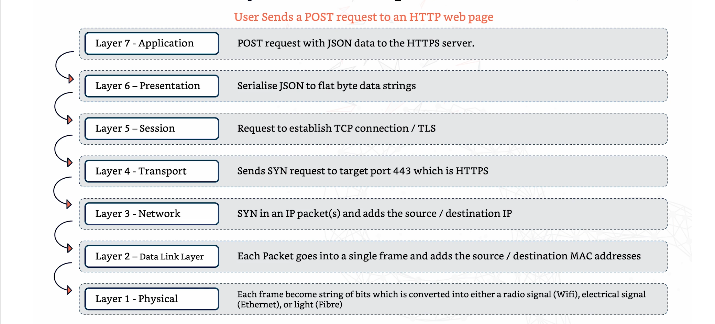
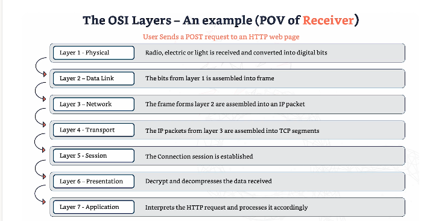

# OSI MODEL

- Open Systems Interconnection Model (OSI Model)
- Provides a standard framework.
  
Why do we need a communication model?
- Application independence - 
  - Without a standard model, applications must understand the underlying network.

- Simplified Network Equipment Management
  - Upgrading network equipment is difficult without a standard model.

- Decoupled Innovation
  - Innovations can happen in each layer independently, without affecting the entire system.

## The 7 layers of the OSI Model

### Layer 1 - Physical layer
- Physical structure.
- Fibre, wireless, hubs, repeaters. 
- Transmits raw bit stream over a phyical medium.
- E.g. cables, switches and network interface cards.
- Physical limitation of this layer = all data is processed by all devices.
- Data isn't organized.

### Layer 2 - Data Layer
- Provides node-to-node data transfer and detects/corrects errors that may occur in the physical layer.
- Traffic cop that ensures data packets are sent and recieved correctly between different network nodes.
- Puts data packets into frames so they're organized. 

### Layer 3 - Network Layer
- Determines how data is sent to the recipient.
- Manages packet forwarding including routing through intermediate routers.
- Components = IP addresses and routers. 
- Data at this layer is organized into packets.
- Packets = small parcels that carry data from one device to another. 
- Routers direct the data packets along the best path across networks.

### Layer 4 - Transport layer
- Responsible for providing reliable data transfer services to the upper layers.
- Delivery service - safe and data in the right order.
- Components = TCP and UDP.

### Layer 5 - Session Layer
- Manages sessions between applications.
- Establishes, maintains and terminates connections.

### Layer 6 - Presentation layer
- Syntax user layer.
- Translates data between the application layer and the network.
- Ensures data is in a usable format.
- Encryption and data formatting.

### Layer 7 - Application layer
- End user layer.
- Provides network services directly to applications.
- Components = HTTP, FTP and SMTP. 

## TCP/IP Model 
- Commonly used model.
- 4 layers:

  1. Application layer
  2. Transport layer
  3. Internet layer
  4. Network Access layer

The OSI model is a teaching and reference framework with 7 layers, while the TCP/IP model is the one the internet actually runs on, with 4 layers

### 1- Application Layer
- Network applications and their products operate here.
- E.g. HTTPS, TLS, DNS etc.

### 2 - Transport layer 
- end-to-end communication and data and transfer between devices happens here.
- TCP, UDP.

### 3 - Internet Layer
- IP
- Responsible for logical addressing and routing data across different networks.

### 4 - Network Access layer
- Ethernet, wireless and LAN.
- Encompassess the physical aspects.

# OSI LAYERS - POV OF SENDER AND RECEIVER

## The OSI layers - POV of sender:

## The OSI layers - POV of receiver:

