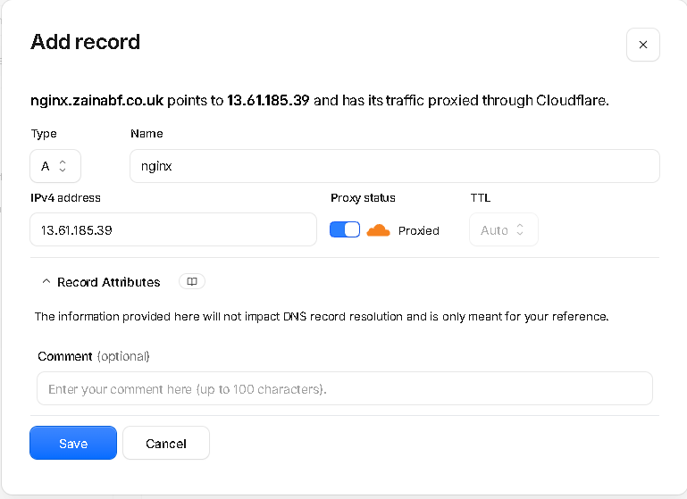
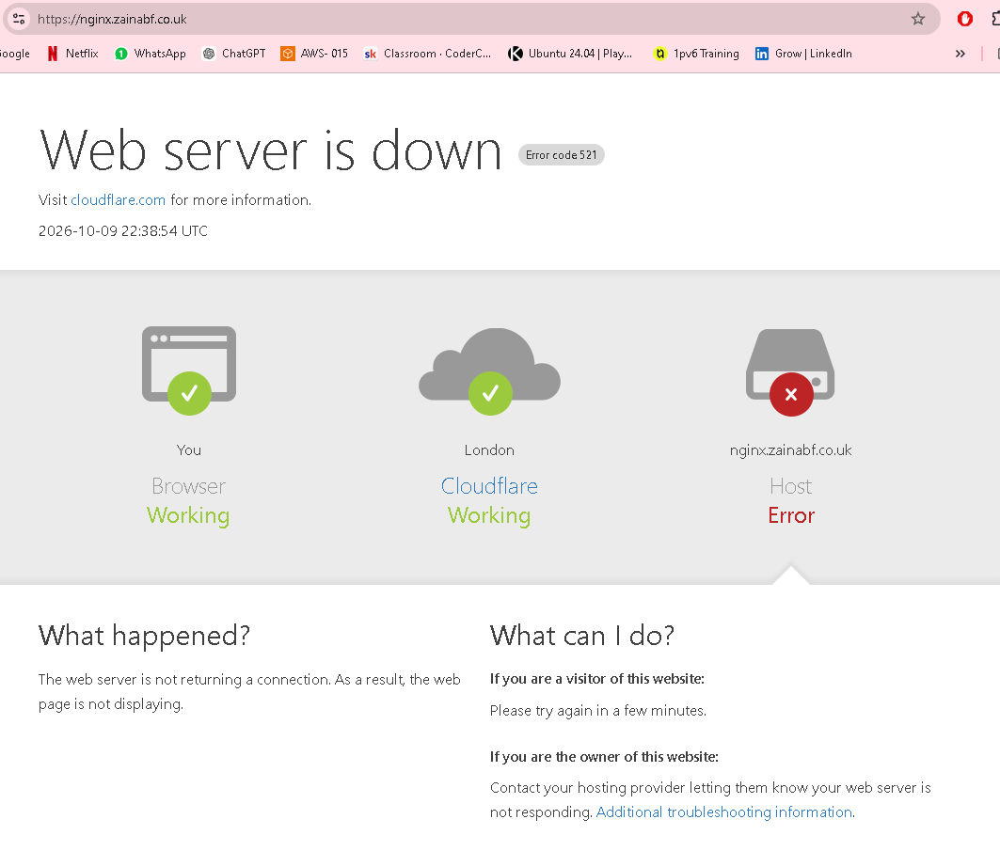
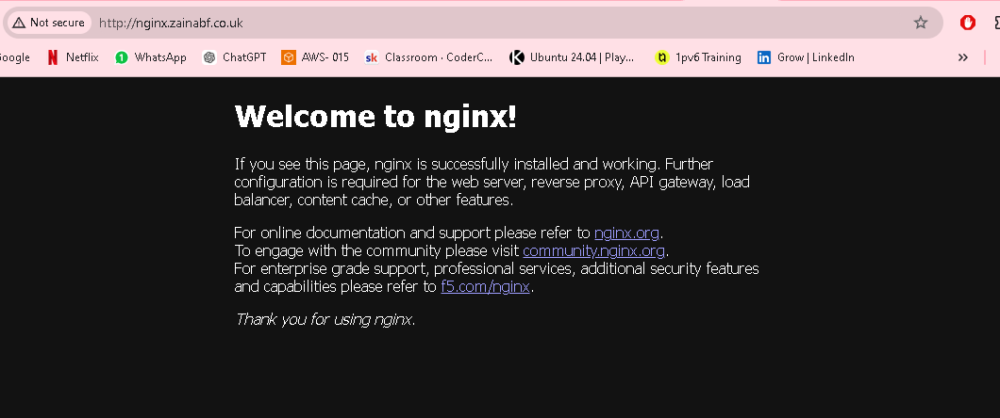

# Project - Using DNS with EC2 

## STEPS NEEDED TO COMPLETE THIS PROJECT:

1. Buy a domain (Cloudflare or Route53)
2. Deploy an EC2 instance running NGINX
3. Create an A record pointing your domain to your EC2 instance
4. Push all work to GitHub in a dedicated repo.

## DEPLOYMENT:

1. BUYING A DOMAIN:
- I bought my own domain - `zainabf.co.uk` on cloudflare for 1 year.

2. Deploying EC2 running nginx:

- Made a new AWS account.
- Create an Amazon linux 2023 server EC2
  - Public IP enabled. No key pair needed for this test project.
  - Connected to EC2 via connect tab in portal. 
- Run these commands to install and run nginx
    - `sudo yum install -y nginx`
    - `sudo systemctl enable nginx`
    - `sudo systemctl start nginx`
    - `sudo systemctl status nginx` --> should show running nginx.
  
- Once nginx is configured, it should be running on that EC2 public IP.
- Check it's running: `http://13.61.185.39/`
- Make sure you use http.

3. Configure DNS

- Go to Cloudflare.
- Add record: 
- The IP address is the EC2 istance's Public IP address.
- A record = routes all traffic to that server to that EC2 public IP.

Go to that domain server page and should see nginx page now!

`http://nginx.zainabf.co.uk/`

### ERROR I ENCOUNTERED

- 1 error I encountered was that when I tried to access the nginx server through my own domain name, it was telling me the server is down. 
- The URL was forcefully using `http` instead of `https`. I was unable to change this. 

### FIX 

- I found that my domain registrar had full level of encryption, meaning my domain was forced to use https.
- This is how I fixed this:
  - In Cloudflare (domain registrar that I'm using) --> SSL/TLS tab on the left.
  - Change encryption mode to `flexible` from `full`. 

= SUCCESS! 

