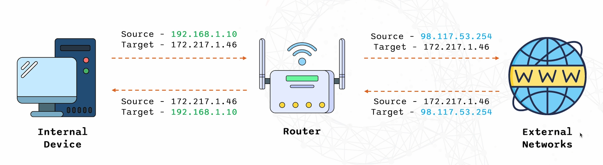

# Subnetting & CIDR

## SUBNETS
- Dividing one large network into smaller more manageable networks.

## CIDR
- E.g. 192.168.1.0/24 
- /24 means 24 network bits and the other 8 bits are host bits which you can use.

## BINARY
- 1s and 0s
- Each digit is a bit.

### Binary to decimal: 

`101010`

- Start from 0 at the end.
- (2^0) x 0 = 1 x 0 = 0 
- (2^1) x 1 = 2 x 1 = 2
- (2^2) x 0 = 4 x 0 = 0 
- (2^3) x 1 = 8 x 1 = 8 
- (2^4) x 0 = 16 x 0 = 0 
- (2^5) x 1 = 32 x 1 = 32

Add all those up = 42 = decimal.

### Binary number into Binary

`192.168.1.1`

- 192 = `11000000` in binary - This is how:
  - Divide 192 by 2 until you reach 0, noting the remainders.
  - 192/2 = 96. remainder 0
  - 96/2 = 48. remainder 0
  - 48/2 = 24. remainder 0
  - 24/2 = 12. remainder 0
  - 12/2 = 6 remainder 0
  - 6/2 = 3 remainder 0
  - 3/2 = 1 remainder 1
  - 1/2 = 0 remainder 1.

  - Read the remainders in reverse = `11000000`

- For 168 = 
  - 168/2 = 84 remainder 0
  - 84/2 = 42 remainder 0
  - 42/2 = 21 remainder 0
  - 21/2 = 10 remainder 1
  - 10/2 = 5 remainder 0
  - 5/2 = 2 remainder 1
  - 2/2 = 1 remainder 0
  - 1/2 = 0 remainder 1
  - binary number = `10101000`

- Binary for 1 = `0000001`

Binary for IP address `192.168.1.1` = `11000000.10101000.00000001.00000001`

- Binary for `10.0.0.1` = `00001010.00000000.00000000.00000001`
- Binary for `255.0.0.0` = `11111111.00000000.00000000.00000000`

## Calculating subnets

- Large network into smaller sub networks. 
- Subnetting determines which part is the network portion and which part is the host portion.

### Subnet masks 

- Defines the network and host portions.
- E.g. `255.255.0.0`
  - Each portion is 8 bits. 
  - The first 2 portions (255) are equivalent to 16 bits.
  - They are the network portions. 
  - The last 16 bits (0) = host portions.

### EXAMPLE: 

- For `192.168.1.0/26`:
  
  - These can't be usable IP addresses because they're reserved for other things:
  
    - Network address (The first address)	= 192.168.1.0
    - Broadcast address (The last address)	= 192.168.1.63
    - Usable IP range = 	192.168.1.1 to 192.168.1.62
    - Number of usable hosts	= 64 -2 = 62

- Step 1: Find how many addresses are in the subnet.
  - An IP address has 32 bits in total. The /26 means 26 bits are used for the network - they're locked, which leaves 32 − 26 = 6 bits for the devices (hosts).

  - 6 bits gives 2⁶ = 64 addresses in each subnet. Think of it as a block of 64 addresses.

  - The /26 also splits 192.168.1.x into four equal blocks of 64. The same steps give you all four:

## NAT
  
- Network Address Translation
- Translated private IP addresses to a public IP address.
- Facilitates communication between internal network and the internet.

### How NAT works:

- Internal devices use private IP addresses.
- Router translates private IP to public IP.
- Facilitates communication between internal network and the internet.

### Types of NAT:

1. Static NAT
   - Maps a single private IP address to a single Public IP address.
  
2. Dynamic NAT
   - Doesnt map 1:1.
   - Maps a private IP address to one of many public IP addresses from a pool.
   - Public IP address gets used from a pool and then goes back into the pool when used. 

3. PAT - port address translation
   - NAT overload.
   - Efficient.
   - Allows multiple devices on a local network to be mapped to a single public IP address with different port numbers.
   - Handles mutliple conversations at once using different port numbers for each one. 

## NAT EXAMPLE

E.G. Zainab connecting to google.com ---> NAT translated private IP to public IP ---> google.com sees the public IP not zainab's private IP.

## BENEFITS OF NAT

- Conserves public IP addresses --> IPV4 running out. Can share a single IP address.
- Enhances network security --> hiding internal IP address.
- Simplifies network design and management.
