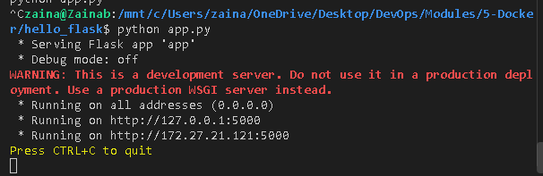

# CREATING A SIMPLE WEB APPLICATION TO DOCKERISE

1. Create simple running web app.
2. Dockerfile = recipe
3. Image = snapshot
4. Run Image as container
5. Linking containers together (SQL).

6. Creating the APP

- Make sure python is installed - `python --version`. 
- Flask = simple and lightweight framework for creating web applications with python. 
  - `pip install flask`
  - Or `sudo apt update && sudo apt install -y python-is-python3 python3-pip python3-flask` In WSL (windows linux)

- Create a new folder - hello_flask. `mkdir hello_flask`
- `cd hello_flask`
- `touch app.py`
- Paste some python code into the app:  Don't need to understand it for now.

```py
from flask import Flask


app = Flask(__name__)

@app.route('/')
def hello_world():
    return 'Hello, world!'

if  __name__ == '__main__':
    app.run(host='0.0.0.0', port=5000)

```
- Run the app:  `python app.py`



If you go to that url: 
- `http://127.0.0.1:5000` : 


- Running on local host using the port number specified in app.py.
- Press CTRL + C = App stops running.


2. Creating a Dockerfile

- This is to create instructions on how to run the app.
- `touch Dockerfile` - in the hello_flask folder.
- Add the following into the dockerfile:

```
FROM python:3.8-slim

WORKDIR /app

# Copy all contents from the current working directory (set to /app already)
COPY . .

RUN pip install flask 

EXPOSE 5000

CMD ["python", "app.py"]
```

3. Creating a Docker Image: 

- `docker build -t hello-flask`
  - `Docker build` = initiates the build process.
  - `-t` flag tags the image with a name.
  - `.` represents the current directory. Tells docker to look for the dockerfile in the current directory.
  - This uses the dockerfile we created to create an image. 


4. Run Image as a Container

- `docker run -d -p 5000:5000 hello-flask`
  - `-d` = detached mode = running in the background. 
  - `-p` = mapping port 5000 on my machine to port 5000 on the container.
- Output of command = container ID.

- Verify this - `docker ps`
- `127.0.0.1:5000` = should show the application!

- To stop the container - use `docker stop <container ID>`
  - Copy the short version of the container ID from `docker ps`. 
- `docker ps` - should show nothing. 
- App should also stop working. 


5. Linking Containers Together - To a MYSQL container.

- Add this into the app.py code: (just remove previous code).

```py
# app.py

from flask import Flask
import MySQLdb

app = Flask(__name__)

@app.route('/')
def hello_world():
    # Connect to the MySQL database
    db = MySQLdb.connect(
        host="mydb",    # Hostname of the MySQL container
        user="root",    # Username to connect to MySQL
        passwd="my-secret-pw",  # Password for the MySQL user
        db="mysql"      # Name of the database to connect to
    )
    # Executing a query to get a mysql version
    cur = db.cursor()
    cur.execute("SELECT VERSION()")
    version = cur.fetchone()
    return f'Hello, World! MySQL version: {version[0]}'

if __name__ == '__main__':
    app.run(host='0.0.0.0', port=5000)
```

- This imports a MySQLdb library - essential for establishing a connection to a mysql database.
  - Allows us to execute SQL commands within the python application.

- Then, a database connection is established.
- Docker allows containers to communicate via container name instead of IP addresses.

### The dockerfile

```
FROM python:3.8-slim

WORKDIR /app

COPY . .

RUN apt-get update && apt-get install -y \
    gcc \
    python3-dev \
    libmariadb-dev \
    pkg-config

RUN pip install flask mysqlclient

EXPOSE 5000

CMD ["python", "app.py"]

```

- Also installs mysql db package.
- Critical - provides the tools needed to connect to mysql database from within the python app. 


### Create a custom network 

- Creating a custom network allows containers to communicate using names instead of IPs. 
- Use this custom network to connect the flask app and mysql container together.
-  `docker network create my-custom-network`
-  

### Creating and running a container for mysql db

-  `docker run -d --name mydb --network my-custom-network -e MYSQL_ROOT_PASSWORD=my-secret-pw mysql:5.7`

   - Creates a container for mysql db.
   - Attaches to the custom network.
   - Set the root password.
   - Using version of mysql 5.7


### Build Docker Image for Flask App

`docker build -t hello-flask-mysql .`


### Create and run the flask application

- `docker run -d --name myapp --network my-custom-network -p 5000:5000 hello-flask-mysql`


SO, both containers are now running. 

- Go to 
`http://127.0.0.1:5000/` --> should see mysql page!

- Make sure port numbers are all adding up! - port 5000 in both app and dockerfile and docker run command. 


### END - STOP CONTAINERS

- `docker ps` - to see running containers.
- `docker stop 04e7212ce90c 9fa3eef1b1db` - ID of both containers.
- `docker ps -a` = shows all the stopped containers too. 