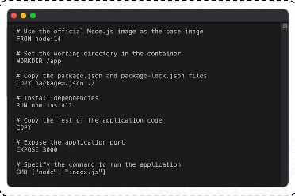

# DOCKERFILE

## Dockerfile 

- Series of instructions on how to build a docker image. 
- Each instruction in the dockerfile creates a layer in the image that makes it easier to track changes and optimize builds.

### Commands used in a dockerfile:

- `FROM` = Specifies the base to use for the docker image.
  - E.g. python, node, javascript etc.

- `RUN` = Executes commands in the container. Install packages, update dependencies etc.

- `COPY` = Copies friles from the host machine into the container. 
  - E.g. move code/file into the container.

- `WORKDIR` = Sets the working directory for the subsequent instructions.

`CMD` = Specifies the command to run when the container starts. 

- EXPOSE 3000 - tells docker that the container will listen on the port 3000.
- EXPOSE 3000 is like sticking a label on the flat saying “visitors use door 3000.” It’s helpful information for whoever runs the container, and some tools read it, but it doesn’t unlock the building’s entrance.

