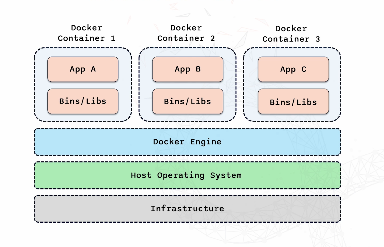
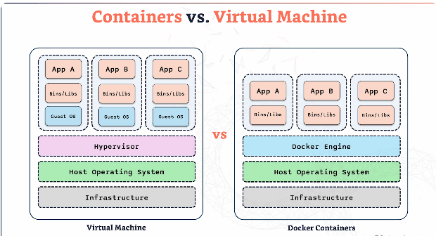
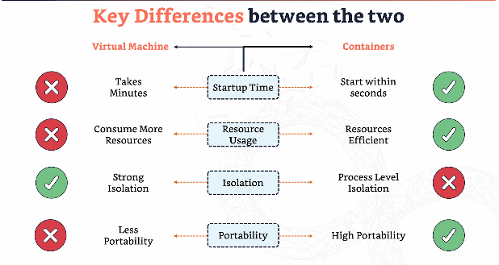

# DOCKER

## What are containers?

- Lightweight portable units for running applications.
- They bundle an application with all it's dependencies, ensuring it runs consistently across different environments. 
- Containers include the code, runtime, library and dependencies the application needs to run. 
- Can run the application anywhere.
- They can easily move from one env to another. 

- Each container has everything the app requires to run the application.
- Containers are completely isolated - they don't interfere with eachother. Isolation and resource efficiency. 
- Each container shares the underlying host OS and docker engine. Lightweight and efficient. 
- Infrastructure = physical/virtual hardware where everything runs.
- Host Operating System = foundation for everything above it. E.g. MacOS.
- Docker engine = makes containerization possible. Builds and manages containers.

## What is Docker?

- Open platform for developing and shipping and running application in containers.
- Simplifies process of managing containers.

- Docker engine = core service that runs and manages containers.
  - responsible for creating and running containers.

- DockerHub = repository for finding and sharing container images. 
  - Pull official or community images. 

- Docker compose = tool for defining and running multi-container docker applications. 
    - E.g. application needs database, cache and web server - docker compose helps to define and orchestrate these components together. 

## Images and Containers

- Images = templates for creating containers.
  - Snapshot of an application.
  - Immutable - don't change after creation.
  - Create images using Dockerfile.

- Dockerfile = instructions of how to create container. 
    - E.g. which image to use, while files to copy, which commands to run. 

- Containers = running instances of images. 

- `docker images` = lists all images.
- `docker rmi` = delete images

- `docker rm -f 1f165ed71603` = delete container using container ID.

- `docker logs <container name>`

# VMs vs Containers 

